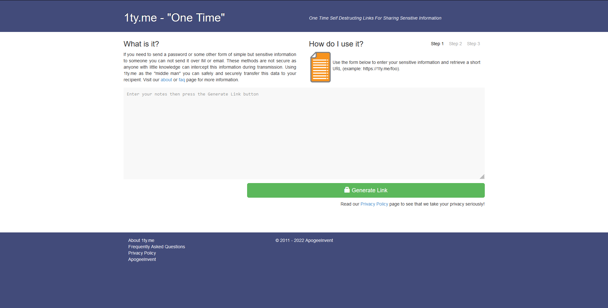

# frontend

## Project setup

```
yarn install
```

### Compiles and hot-reloads for development

```
yarn serve
```

# backend

## Project setup

### create a mega storage and write mail and password to .env

# about project

## site for sending anonymous notes


